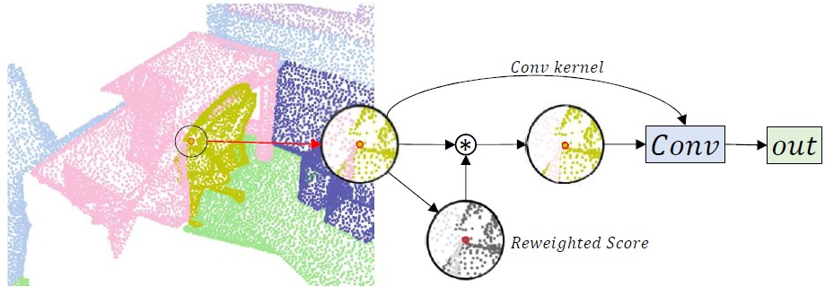

# PointConvFormer
*Wenxuan Wu, Li Fuxin, Qi Shan*

This is the PyTorch implementation of our paper [**PointConvFormer**]
<div align="center">
    
</div>

## Introduction

We introduce PointConvFormer, a novel building block for point cloud based deep neural network architectures. PointConvFormer combines ideas from point convolution, where filter weights are only based on relative position, and Transformers where the attention computation takes the features into account. In our proposed new operation, feature difference between points in the neighborhood serves as an indicator to re-weight the convolutional weights. Hence, we preserved some of the translation-invariance of the convolution operation whereas taken attention into account to choose the relevant points for convolution. We also explore multi-head mechanisms as well. To validate the effectiveness of PointConvFormer, we experiment on both semantic segmentation and scene flow estimation tasks on point clouds with multiple datasets including ScanNet, SemanticKitti, FlyingThings3D and KITTI. Our results show that %the deep network built with PointConvFormer substantially outperforms classic convolutions, regular transformers, and voxelized sparse convolution approaches with smaller, more computationally efficient networks.

## Highlight
1. We introduce PointConvFormer which modifies convolution by an attention weight computed from the  differences of local neighbourhood features. We further extend the PointConvFormer with a multi-head mechanism.
2. We conduct thorough experiments on semantic segmentation tasks for both indoor and outdoor scenes, as well as  scene flow estimation from 3D point clouds on multiple datasets. Extensive ablation studies are conducted to study the properties and design choice of PointConvFormer.

## Installation

### Environment
The minimal GPU requirement is GTX 1050 due to the use of CUDA compute capabilities 6.

1. Install dependencies

One would need a working PyTorch installed. This code was tested to work in pyTorch 1.8 and 1.12, with CUDA 10.1 and 11.3 respectively.

One possibility is to run: 
```
conda install pytorch==1.8.0 torchvision==0.9.0 torchaudio==0.8.0 cudatoolkit=10.1 -c pytorch
```
However usually you should already have a docker environment that takes care of pyTorch.

Afterwards, running setup.sh will download all the prepared ScanNet dataset as well as installing the required packages. 

```
setup.sh
```

### Data Preparation

### Training

1. Before training, please setup the `train_data_path` and `val_data_path` in `configFLPCF_10cm.yaml`;

2. You might also want to set the `model_name`, `experiment_dir` accordingly in `configFLPCF_10cm.yaml`;

3. If you use turibolt and would like to save the results to blobby, Please set the `save_to_blobby` to `True`, and `use_tensorboard` to `False` in `configFLPCF_10cm.yaml`;

4. Change other settings in `configFLPCF_10cm.yaml` based on your experiments;

5. To train a model with `n` gpus, change the `num_gpus` and `devices_ids` accordingly in `configFLPCF_10cm.yaml`. Change the `--nproc_per_node` to be `n` in `run_distributed.sh`. Make sure this matches your Turi Bolt configuration settings otherwise the system will give an error prompt.

6. Make sure you have the same number of CPUs as num_workers in the config file.

6. ```sh run_distributed.sh config_file_name```

### Evaluation

<!-- (Obselete Please download the pretrain weights of the models at [here](https://drive.google.com/file/d/1BShjM0PydlEX-bE7k3-fg2UBORpwUeWR/view?usp=sharing)) -->

Then, you can evaluate with the following comand:

```
python test_ScanNet_guided_2cmV4_time_simple.py --config ./configFLPCF_10cm.yaml --pretrain_path ./pretrain/[model_weights].pth
```
which will evaluate the time as well as outputting ply files for each scene.
